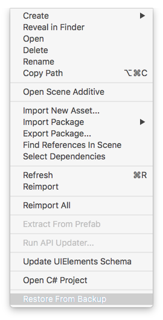

# `UnityExtensions.AssetBackup`

Whenever assets are saved, this extension will copy them from `Assets/path/to/asset` to `Backups/path/to/asset(timestamp)`.  Later, you can select an asset and right click in the project view or open the `Assets` menu and select `Restore From Backup`:

The `Restore From Backup` window will open, and you can select which backup file to restore:

When you click the `Restore` button, the backup file will be copied over the selected asset and the AssetDatabase will be refreshed.  If the restored asset is the active scene, it will be reloaded.

# Future Ideas

* Add a Preference Pane with the following options:

    * Maximum number of backups to keep?
    * Which asset types to backup?